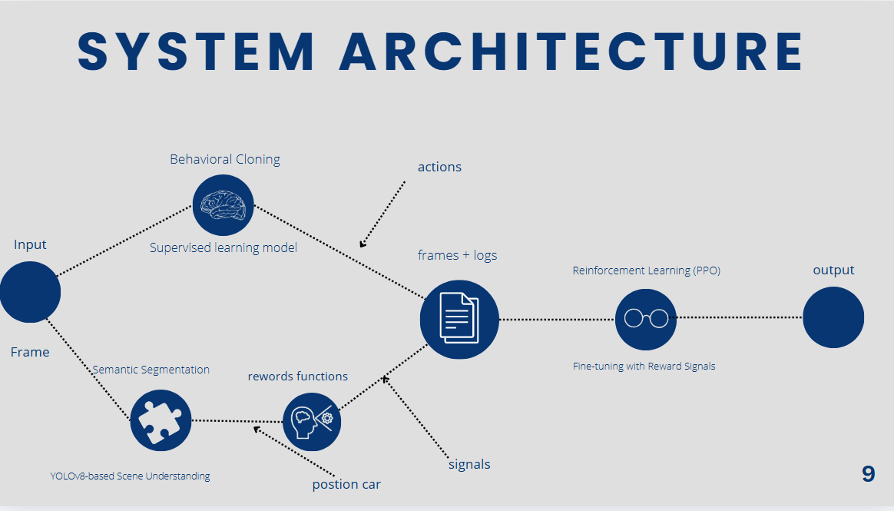
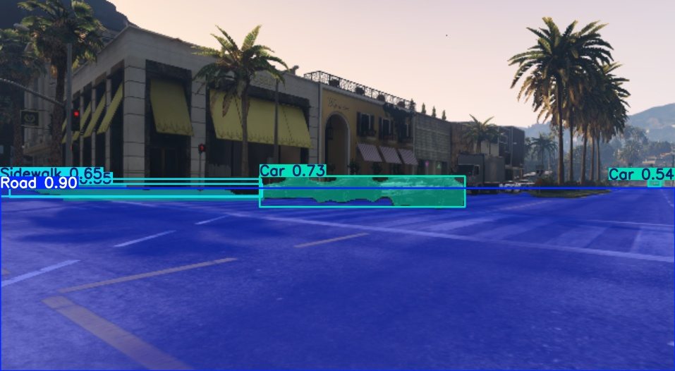
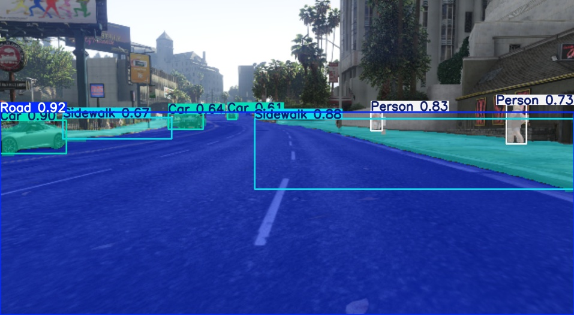
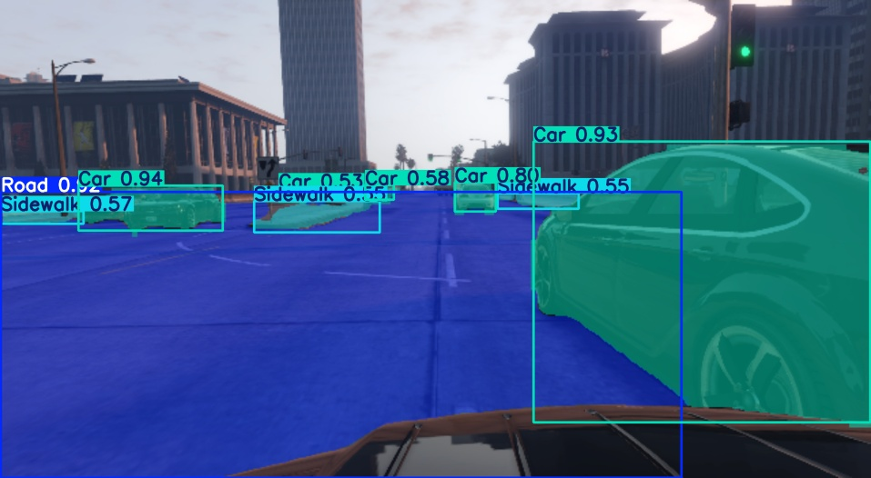
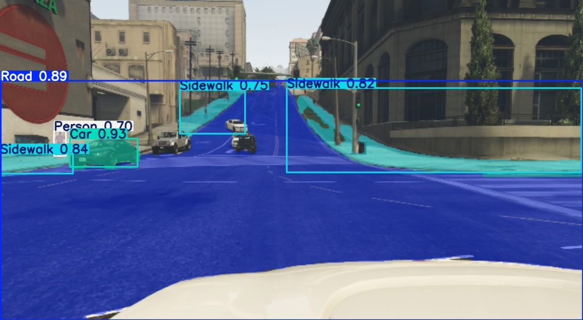
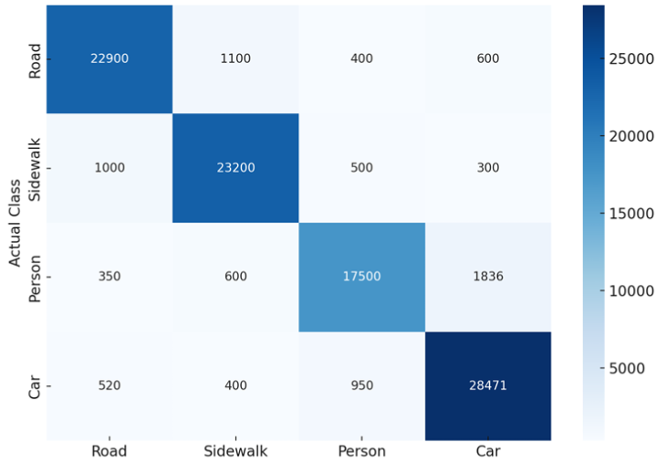
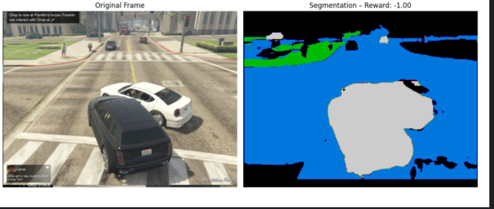
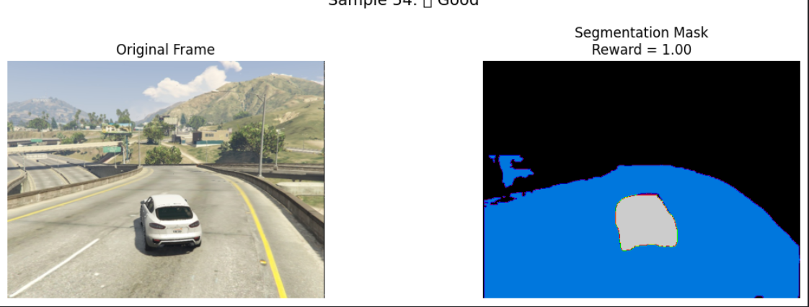

# 🚗 Self-Driving Car in GTA V — Hybrid AI Approach

**Autonomous navigation in a simulated open-world environment using computer vision, supervised learning, and reinforcement learning.**



---

## 📌 Overview
This project implements and evaluates a self-driving car system inside the **Grand Theft Auto V** simulation environment.

It combines:
- **Perception** — semantic segmentation via **YOLOv8**
- **Control** — supervised learning (behavioral cloning) & reinforcement learning (PPO)
- **Hybrid Learning** — merging supervised & RL for adaptability

The agent drives **using only visual input** — no GPS, LiDAR, or radar.

---

## 🎯 Objectives
- Develop a **visual-only** self-driving system.
- Explore lane detection, semantic segmentation, behavioral cloning, and PPO reinforcement learning.
- Compare **pure supervised** vs **hybrid supervised+RL** approaches.
- Deploy in real-time simulation.

---

## 🛠️ Methodology

### 1️⃣ Perception: Semantic Segmentation
- Dataset: *Playing for Data* GTA V dataset (TU Darmstadt)
- Classes used: Road, Sidewalk, Car, Person
- Best Model: **YOLOv8**
- **Results:**





**Confusion Matrix:**


---

### 2️⃣ Control Approaches

#### **Supervised Learning — Behavioral Cloning**
- **Best Model:** CNN V2 (DeepDriveNet)  
  Validation accuracy: **76.7%**
- **Training Comparison:**


---

#### **Reinforcement Learning — PPO**
- PPO chosen over DQN for stability in continuous tasks.
- Reward from segmentation masks:
  - `+1` on road
  - `-1` sidewalk
  - `-1.5` collision with car/person
- **Reward Visuals:**



---

#### **Hybrid Model**
- Start with supervised CNN policy.
- Fine-tune with PPO to improve recovery & adaptability.

---

## 📊 Results

| Metric              | Supervised CNN | Hybrid (CNN + PPO) |
|--------------------|---------------|--------------------|
| Training Speed     | Fast          | Slower             |
| Highway Driving    | Good          | Very Good          |
| City Driving       | Weak          | Moderate           |
| Recovery Ability   | Weak          | Strong             |
| Adaptability       | Low           | High               |
| Inference Speed    | Very Fast     | Fast               |

---

## 🖥️ Deployment

Two real-time pipelines implemented:

1. **CNN Deployment**
   - Capture → Preprocess (grayscale) → Predict → Map to keypress → Drive in GTA V

2. **PPO Deployment**
   - Capture → Preprocess → PPO policy predicts → Map to keypress → Drive

---

## 📽️ Demo Video
*(Will be added once uploaded)*  
📺 **[Watch Demonstration](#)**

---

## ⚙️ Installation
```bash
git clone https://github.com/Rassembali/self-driving-car.git
cd self-driving-car
pip install -r requirements.txt
